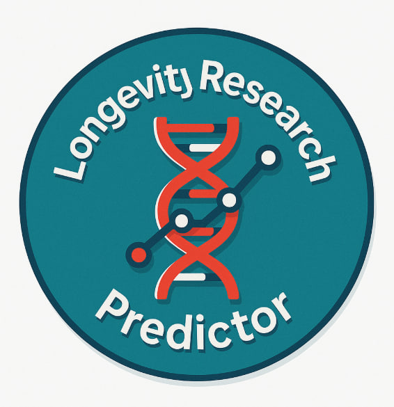
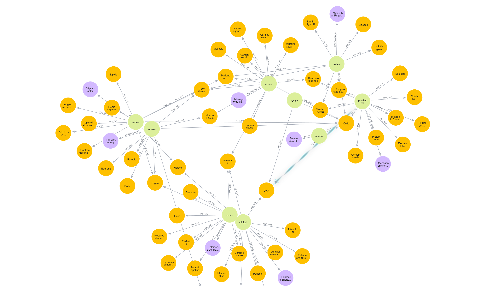
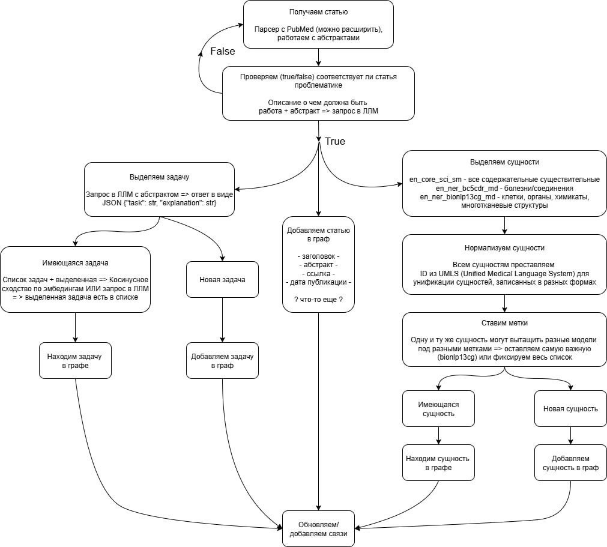

<table>
  <tr>
    <td style="width:30%; vertical-align:middle;">
      
    </td>
    <td style="vertical-align:middle;">
      <h1 style="display:inline-block; margin-left: 20px;">Longevity Research Predictor</h1>
    </td>
  </tr>
</table>

**Система анализа и прогнозирования приоритетных направлений исследований в области биологии старения и долголетия на основе обработки научных статей с использованием графов знаний и машинного обучения.**

## Пример работы сервиса

<p style="width: 50%; text-align: center;">
  
  <br/>
  <span><b>Визуализация графа знаний, показывающая связи между исследовательскими задачами, научными статьями и биомедицинскими терминами</b></span>
</p>

<p style="width: 50%; text-align: center;">
  
  <br/>
  <span><b>Кластеризация исследовательских задач по семантической близости для выявления основных направлений исследований</b></span>
</p>

# Развертывание сервиса

## Переменные окружения
```bash
# LLM API настройки
LLM_API_BASE_URL=http://localhost:8000/v1
LLM_API_KEY=sk-dummy-key
LLM_MODEL=llama-3.3-70b-instruct

# Порт для frontend
LISTEN_PORT=8501

# Логирование
LOG_LEVEL=INFO
```

*Перед запуском настройте необходимые переменные окружения в `.env`, или скопируйте `.env.example` в `.env`*

### Загрузка моделей

Скачайте архивы моделей из `https://drive.google.com/drive/folders/1JlpaZjutgf6oe0ln_d58Ml54pwmPnUb8` и распакуйте их в папку `./models` в корне проекта


### Bash запуск
```bash
# Запуск через docker
docker compose up -d
```

*Приложение микросервисное на основе Docker, запуск в одну команду.*

Открыть в браузере `http://localhost`

# Архитектура


## Докер контейнеры

На сервисе развернуты следующие компоненты:

| Название                | Предназначение                                              | Порт        |
|-------------------------|------------------------------------------------------------|-------------|
| Frontend (Streamlit)    | Веб-интерфейс для визуализации и анализа данных            | 80          |
| Backend (FastAPI)       | API сервис с NER и embedding моделями                      | 3000        |
| Qdrant (Vector DB)      | Векторная база данных для хранения эмбеддингов             | 6333        |
| Neo4j (Graph DB)        | Графовая база данных для хранения связей                   | 7474/7687   |
| Agent                   | Контейнер для агентов: парсинг, построение графа, генерация отчётов и др. задачи | 3001        |


**ML компоненты в Backend:**
- **2 spaCy модели для NER**: `en_ner_bc5cdr_md` и `en_ner_bionlp13cg_md` для извлечения именованных сущностей
- **SentenceTransformer**: `BAAI/bge-large-en-v1.5` для создания эмбеддингов
- **UMLS линкинг**: планируется интеграция для нормализации биомедицинских терминов

---

# Принцип работы




**Принцип работы сервиса:**

1. **Обработка статей**: Получаем статьи из PubMed/BioRxiv и анализируем абстракты
2. **Фильтрация**: Проверяем релевантность статей к проблематике долголетия
3. **Извлечение сущностей**: Используем NER модели для выделения биомедицинских терминов
4. **Создание эмбеддингов**: Генерируем векторные представления текстов
5. **Хранение данных**: 
   - Эмбеддинги сохраняем в Qdrant (векторная БД)
   - Связи между сущностями храним в Neo4j (графовая БД)
6. **Визуализация**: Streamlit интерфейс для анализа и отображения результатов

**Текущий статус**: Базовая инфраструктура развернута, ML модели загружаются, планируется интеграция с LLM для извлечения исследовательских задач.

---

# Структура файлов

#### Микросервисная архитектура
```
longevity-predictor/
├── frontend/                    # Streamlit приложение для визуализации
│   ├── src/
│   │   └── app.py              # основной файл Streamlit приложения
│   ├── Dockerfile
│   └── requirements.txt
├── backend/                     # FastAPI сервис с ML компонентами
│   ├── src/
│   │   └── main.py             # API эндпоинты для NER и эмбеддингов
│   ├── Dockerfile
│   └── requirements.txt
├── qdrant/                      # конфигурация векторной базы данных
├── neo4j/                       # конфигурация графовой базы данных
├── models/                      # директория для ML моделей (spaCy, SentenceTransformer)
├── assets/                      # изображения для документации и визуализации
├── docker-compose.yml           # оркестрация всех сервисов
└── .env                         # переменные окружения (создать из .env.example)
```

---

# Команда

**Команда AGI Team:**

|     | Имя | GitHub | Позиция |
|-----|-----|--------|---------|
| 1. | Борисов Никита | [**nizier193**](https://github.com/Nizier193) | ML (NLP) |
| 2. | Анна Чифранова | [**amsurex**](https://github.com/amsurex) | ML (NLP) |
| 3. | Дашевский Илья | [**idashevskii**](https://github.com/idashevskii) | Fullstack |
| 4. | Янышевская Карина | [**fanot**](https://github.com/fanot) | ML (NLP) |
| 5. | Вадим Баталев | [**d0zya**](https://github.com/d0zya) | ML (NLP) |
| 6. | Семенов Дмитрий | [**Sem-dmitry**](https://github.com/Sem-dmitry) | ML (NLP) |
