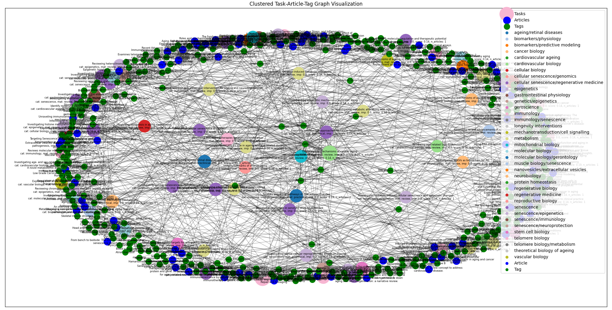
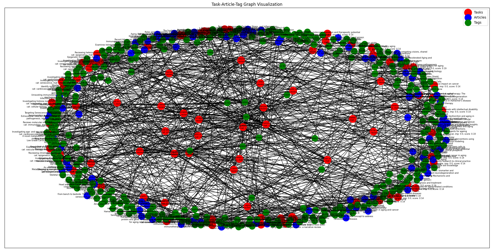
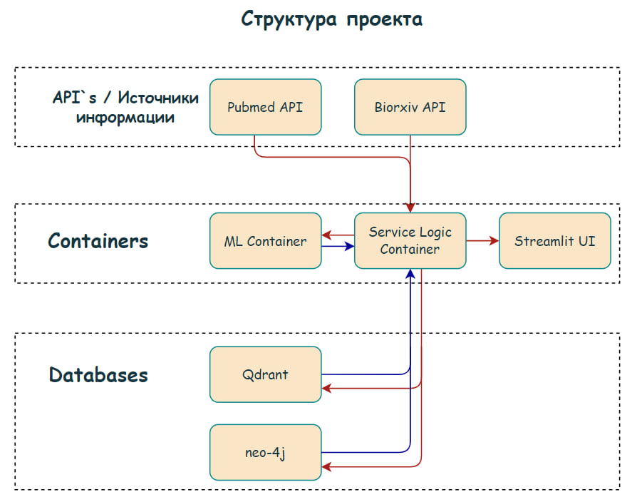
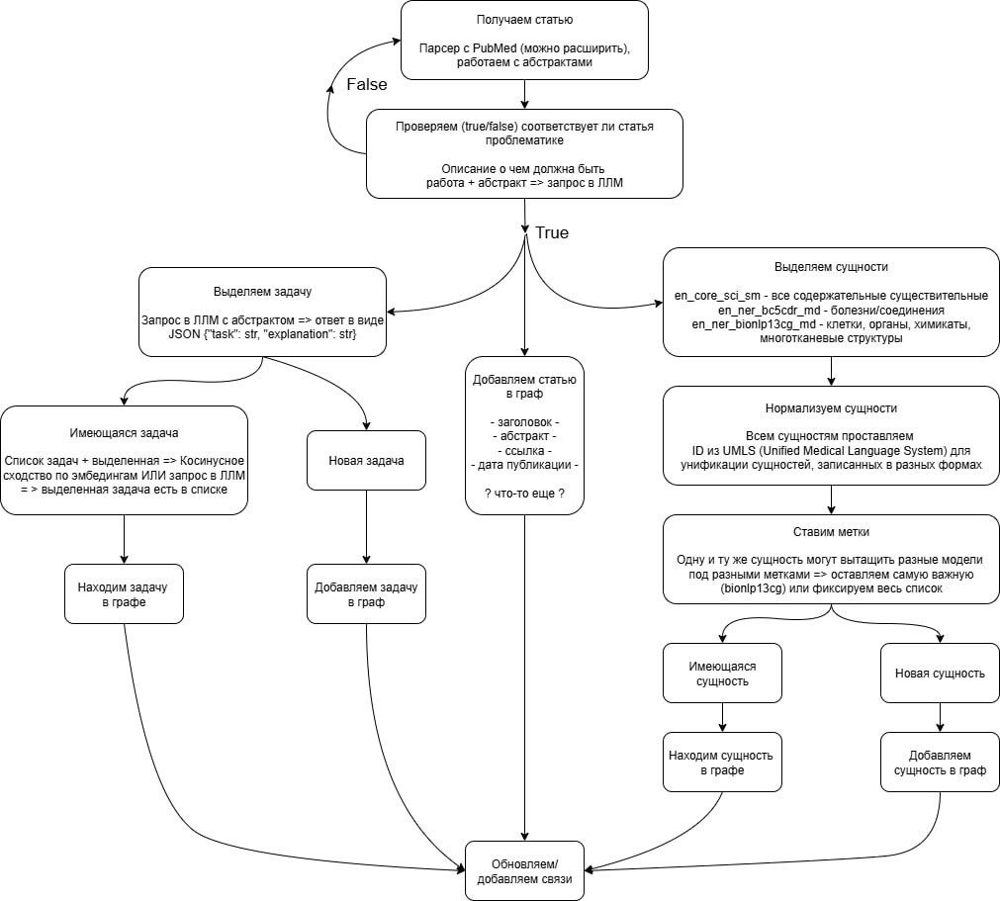

# Longevity Research Predictor 🧬

**Система анализа и прогнозирования приоритетных направлений исследований в области биологии старения и долголетия на основе обработки научных статей с использованием графов знаний и машинного обучения.**

## Пример работы сервиса

<div style="display: flex; gap: 24px; align-items: flex-start;">
  <div style="flex: 1; text-align: center;">
    
    <br/>
    <span><b>Визуализация графа знаний, показывающая связи между исследовательскими задачами, научными статьями и биомедицинскими терминами</b></span>
  </div>
  <div style="flex: 1; text-align: center;">
    
    <br/>
    <span><b>Кластеризация исследовательских задач по семантической близости для выявления основных направлений исследований</b></span>
  </div>
</div>

## Развертывание сервиса

### Переменные окружения
```bash
# LLM API настройки
OPENAI_BASE_URL=http://localhost:8000/v1
OPENAI_API_KEY=sk-dummy-key

# NER и Embedding сервис
NER_SERVICE_URL=http://localhost:8001

# Пути к данным
TASKS_DB_PATH=tasks_db.json
GRAPH_PATH=full_longevity_graph.pkl
```

*Перед запуском настройте необходимые переменные окружения в `.env`, или скопируйте `.env.example` в `.env`*

### Bash запуск
```bash
# Запуск через docker
docker compose up -d
```

*Приложение микросервисное на основе Docker, запуск в одну команду.*

## Архитектура



### Докер контейнеры

На сервисе развернуты следующие компоненты:
<div style="display: flex; gap: 32px; margin-bottom: 24px;">
  <div style="flex: 1; background: #f5f7fa; border-radius: 18px; padding: 24px; min-width: 220px; box-shadow: 0 2px 8px rgba(0,0,0,0.04);">
    <p style="margin: 0; text-align: center; color: #000000;">
        <b>Service Logic Container</b>
        <p style="color: #000;">Контейнер со всей логикой: построение графа, апдейт связей, retrieve наиболее релевантных, расчёт скора и пр.</p>
    </p>
  </div>
  <div style="flex: 1; background: #f5f7fa; border-radius: 18px; padding: 24px; min-width: 220px; box-shadow: 0 2px 8px rgba(0,0,0,0.04);">
    <p style="margin: 0; text-align: center; color: #000000;">
        <b>ML Container</b>
        <p style="color: #000;">Контейнер с тяжеловесными ML-компонентами. </p>
    </p>
  </div>
  <div style="flex: 1; background: #f5f7fa; border-radius: 18px; padding: 24px; min-width: 220px; box-shadow: 0 2px 8px rgba(0,0,0,0.04);">
    <p style="margin: 0; text-align: center; color: #000000;">
        <b>Streamlit UI</b>
        <p style="color: #000;">Визуализация с помощью Streamlit. Демонстрация графа, отрисовка деталей узлов и пр.</p>
    </p>
  </div>
</div>

---

### Принцип работы



**Принцип работы сервиса:**

1. Получаем статью (PubMed или BioRxiv, работаем с абстрактом).
2. Проверяем, относится ли статья к проблематике (фильтрация по ключевым словам и авторам из ITM).
3. Если статья релевантна:
    - Выделяем задачи с помощью LLM (по абстракту).
    - Добавляем новые задачи в граф, ищем похожие задачи для объединения.
    - Выделяем сущности (биомедицинские термины) с помощью NER-моделей.
    - Нормализуем сущности через UMLS.
    - Ставим метки (тип сущности, принадлежность к задачам и т.д.).
    - Добавляем новые сущности в граф, ищем и объединяем дубликаты.
4. Обновляем связи между задачами и сущностями в графе знаний.

В результате формируется и обновляется граф знаний по задачам и сущностям из научных статей.

---

### Структура файлов (undone yet)

#### Основные компоненты
- **`graph_making.py`** - основной модуль обработки статей, извлечения задач и построения графа знаний
- **`llm_task_clustering.py`** - кластеризация исследовательских задач с помощью LLM
- **`ner_linker_service.py`** - FastAPI сервис для NER и эмбеддингов с интеграцией UMLS
- **`graph_render.py`** - промежуточная визуализация графа (до финальной версии от Карины)
- **`reporting_agent.py`** - агент формирования отчетов по топ-задачам

#### Данные
- **`full_longevity_graph.pkl`** - полный граф знаний
- **`tasks_db.json`** - база данных исследовательских задач
- **`pubmed_articles.json`** - обработанные статьи из PubMed
- **`biorxiv_articles.json`** - обработанные препринты из BioRxiv

#### Индексы и кеши
- **`full_pubmed_index/`** - FAISS индекс для поиска по статьям
- **`short_index/`** - сокращенный индекс
- **`llm_cache.json`** - кеш запросов к LLM
- **`llm_log.jsonl`** - логи взаимодействий с LLM

#### Визуализация
- **`streamlit_app.py`** - веб-интерфейс для анализа данных
- **`graph_visuals/`** - изображения графов знаний

#### Вспомогательные модули
- **`scorer_v2/`** - система оценки приоритетности задач
- **`reports/`** - сгенерированные отчеты
- **`parcer_biorxiv.py`** - парсер BioRxiv
- **`pubmed_parcer.py`** - парсер PubMed

---

## Команда

**Команда AGI Team:**

|     | Имя | GitHub | Позиция |
|-----|-----|--------|---------|
| 1. | Борисов Никита | [**Nizier193**](https://github.com/Nizier193) | ML (NLP) |
| 2. | Анна Чифранова | [**amsurex**](https://github.com/amsurex) | ML (NLP) |
| 3. | Дашевский Илья | [**idashevskii**](https://github.com/idashevskii) | Fullstack |
| 4. | Янышевская Карина | [**fanot**](https://github.com/fanot) | ML (NLP) |
| 5. | Вадим Баталев | [**d0zya**](https://github.com/d0zya) | ML (NLP) |
| 6. | Семенов Дмитрий | [**Sem-dmitry**](https://github.com/Sem-dmitry) | ML (NLP) |
